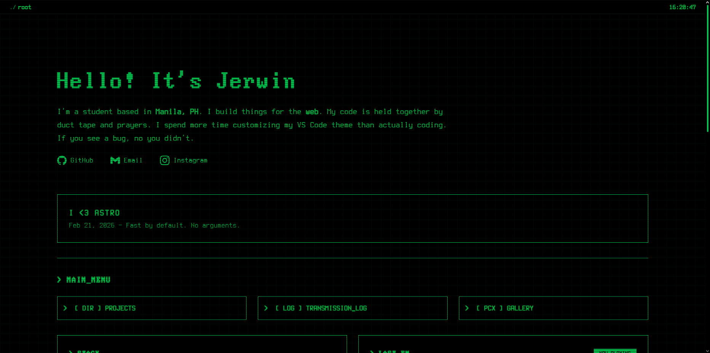

<h1 align="center">jrwnnnn-me : terminal-folio</h1>

<i>My personal slice of the web. Built with Astro, wrapped in a phosphor green-on-black theme.</i>

   <!-- FIND PREMADE BADGES HERE: https://github.com/Ileriayo/markdown-badges -->
   
   
   

 

## License

Copyright (c) 2026 Mark Jerwin(@jrwnnnn). All rights reserved.

No permission is granted to any person to copy, modify, merge, publish, distribute, sublicense, sell, or create derivative works based on this software, in whole or in part, without prior explicit written consent from the copyright holder.

 
 

